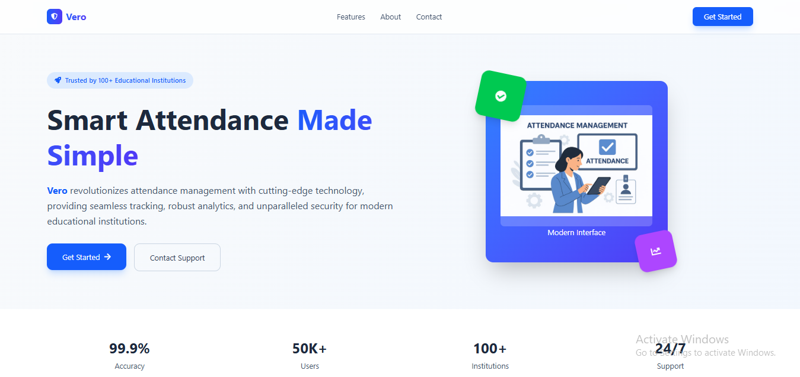
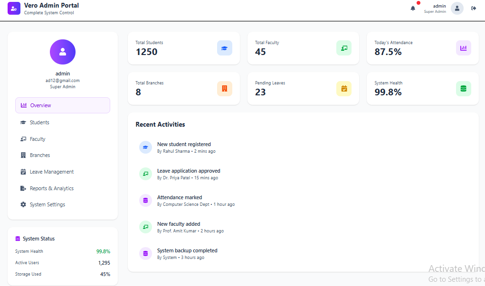
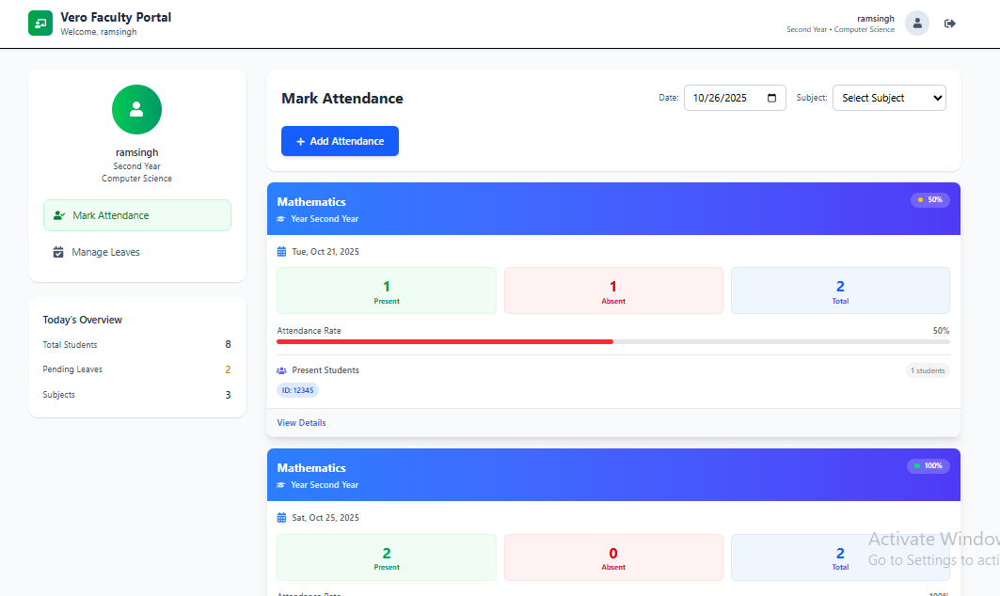

# 📚 Smart Attendance Management System

A full-stack web application designed to automate student attendance, reduce manual workload, and improve accuracy in academic record-keeping.

---

## 🚀 Tech Stack

| Layer | Technology |
|------|------------|
| Frontend | React, Tailwind CSS |
| Backend | Java, Spring Boot |
| API Testing | Postman |
| Database | MySQL |
| Version Control | Git & GitHub |

---

## ✨ Features

- Student & Faculty Login System  
- Real-time Attendance Marking  
- Admin Dashboard for managing users, courses & subjects  
- Attendance Reports & Analytics  
- Secure Authentication & Role-Based Access  
- Leave Request and Approval System  
- Automated Attendance Records Storage  

---

## 📂 Project Structure

```
ams/
├── backend/
│   ├── src/
│   ├── pom.xml
│   └── application.yml
├── frontend/
│   ├── src/
│   ├── public/
│   └── package.json
├── database/
│   └── schema.sql
└── docker-compose.yml
```

## ⚙️ Installation & Setup
### Clone Repository
```bash
git clone https://github.com/YOUR-USERNAME/smart-attendance-system.git

cd smart-attendance-system
```
### Frontend Setup
```bash
cd frontend
npm install
npm start

```
### Backend Setup
```bash
cd backend
mvn clean install
mvn spring-boot:run
```
## 🛢️ Database Setup
- Open MySQL Workbench
- Import schema.sql
- Update DB credentials in ```application.properties```
---
 
## 🧪 API Testing
- All endpoints tested using Postman
- Includes login, attendance submission, leave requests & admin actions
---

## 📈 Output / Results

- Eliminates manual entry process
- Improves accuracy & productivity
- Provides secure and structured attendance data storage.
---

## 📸 Screenshots

#### 🏠 Landing Page  


#### 🔐 Login Page


#### 🏠 Dashboard


#### ✅ Attendance Page


---
## 👩‍💻 Author
- Priyanka Bhandari
- Engineering Student | Frontend Developer (React)
Mumbai, India
[Linkedin ]([https://github.com/your-username/your-repo-name](https://www.linkedin.com/in/pr-bhandari?utm_source=share&utm_campaign=share_via&utm_content=profile&utm_medium=android_app))

